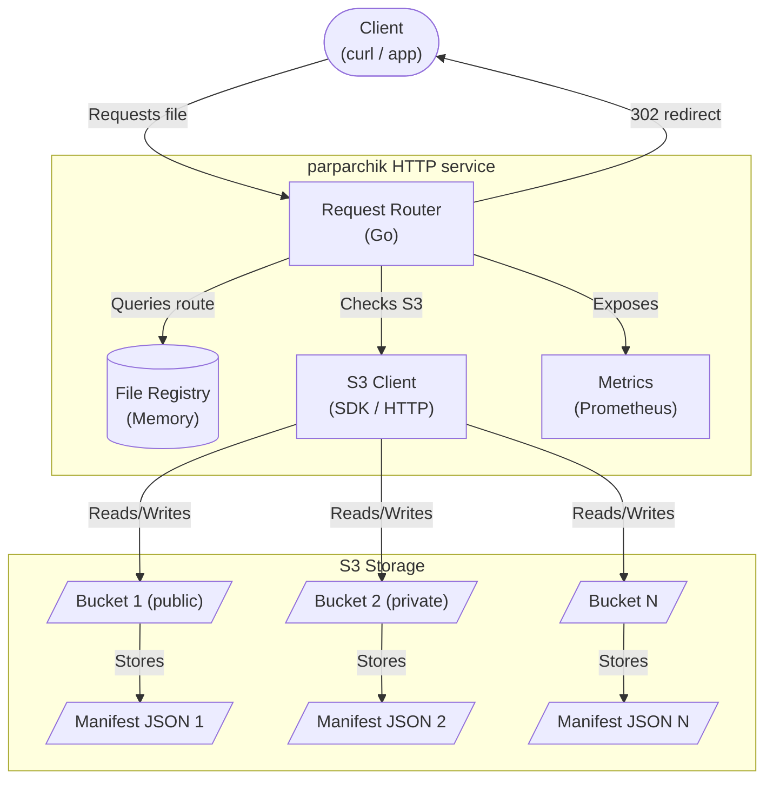
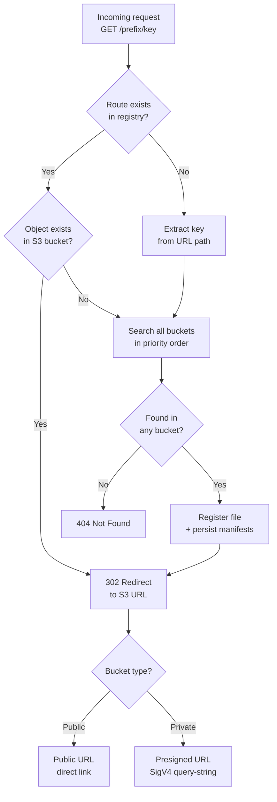
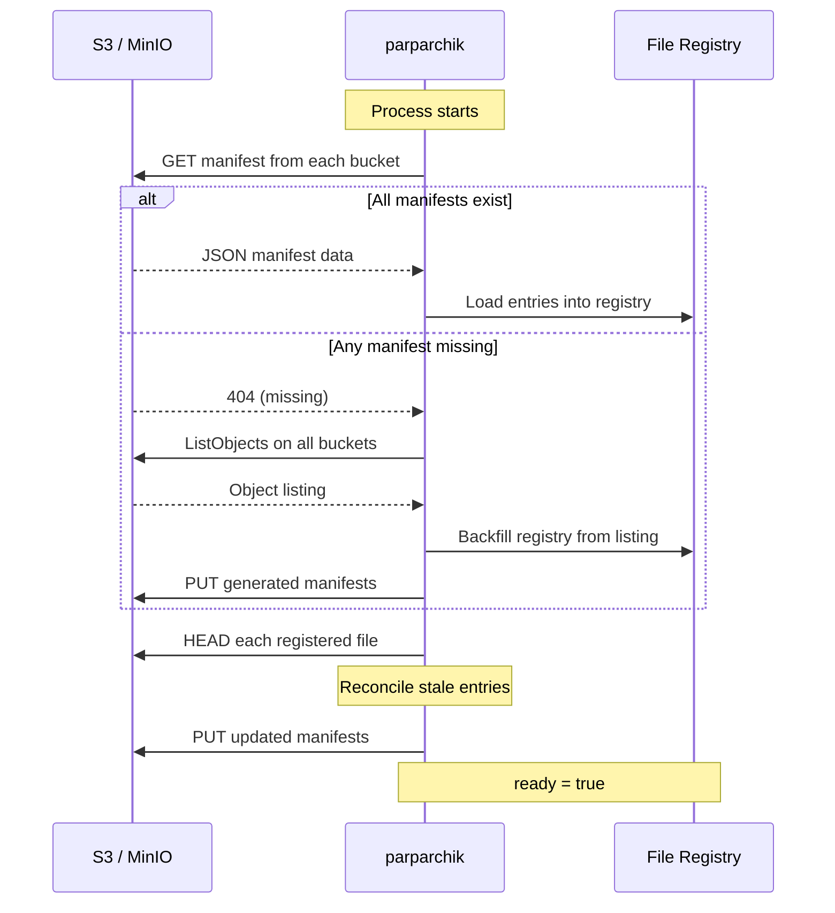

# parparchik

<p align="center">
  
</p>

`parparchik` is an S3 file routing service, implemented in Go (`golang/`,
recommended) with a Python reference server (`server.py`) kept for
comparison. It routes versioned files from multiple configurable S3 buckets
with public or private access, serving redirects to S3 URLs, and is built
to grow into a general multi-format artifact repository — see
[`docs/plans/`](plans/) for the roadmap toward Maven, npm, PyPI, Docker,
Helm, NuGet, Debian, RPM, Terraform, and ML-model repository support.

## Features

- Dynamic file routes for each configured bucket.
- In-memory file registry loaded from JSON manifests stored in each bucket.
- Startup backfill from S3 when manifests do not exist yet.
- Bucket priority precedence when the same key exists in multiple buckets.
- Runtime repair when manifests are stale or disagree with real bucket contents.
- `/status`, `/redines`, `/readiness`, and `/healthcheck` probes.
- Prometheus metrics for file counts per bucket, duplicate detection, and recent uploads.
- Prometheus alert rule for duplicate files across S3 buckets.
- Prometheus, Alertmanager, Grafana, Docker Compose, and Argo CD examples.
- Optional API-key authentication and per-client-IP rate limiting.
- Extensible repository-format architecture (`internal/format.Format`).

## High-level architecture



## Go implementation

| Component | Go |
|-----------|-----|
| Runtime | `net/http` (Go 1.22+ `ServeMux` method+wildcard routing) |
| S3 SDK | `aws-sdk-go-v2` |
| State | mutex-guarded in-memory catalog (`internal/catalog`) |
| JSON | `encoding/json` |
| Metrics | Prometheus `client_golang` |
| Concurrency | goroutines |
| File routes | `/<bucket-name>/<key>`, plus `/public/<key>`/`/private/<key>` resolved by bucket type |

See [`golang/README.md`](https://github.com/rachlenko/parparchik/blob/main/golang/README.md)
for the package layout and extension guide.

## Request routing flow



## Startup lifecycle



## Runtime flow

1. Startup reads manifests from all configured buckets using their respective keys.
2. If any manifest is missing, parparchik scans all buckets, builds the in-memory registry, writes manifests back, and becomes ready.
3. If manifests exist, parparchik loads them and verifies each record against actual S3 object existence.
4. If the same key exists in multiple buckets, the highest priority bucket (first in config) wins.
5. On request miss or stale route, parparchik checks buckets in priority order, serves the found route, updates memory, and writes all manifests.

## Manifest format

```json
{
  "version": 1,
  "bucket": "private-bucket",
  "files": [
    {
      "key": "1mb_v0.0.1_file.tgz",
      "bucket": "private-bucket",
      "route": "/private-bucket/1mb_v0.0.1_file.tgz",
      "size": 1048576,
      "last_modified": "2026-05-05T10:00:00Z"
    }
  ]
}
```

## API

| Endpoint | Description |
| --- | --- |
| `/status` | Configuration, readiness, and file count. |
| `/list` | Current in-memory registry entries. |
| `/update?filename=<key>` | Resolve a key and repair manifests on miss/stale state. |
| `POST /relocate?filename=<key>` | Verify file location, relocate registry entry between buckets. |
| `/metrics` | Prometheus metrics. |
| `/<bucket>/<key>` | Redirect to S3 URL. |
| `/public/<key>`, `/private/<key>` | Redirect to S3 URL, resolved by bucket type. |
| `/redines`, `/readiness` | Readiness probe. |
| `/healthcheck` | Liveness probe. |

## Monitoring

`/metrics` exposes Prometheus gauges:

- `parparchik_volume_files{volume="<bucket>"}` — file count per bucket.
- `parparchik_duplicate_files` — file keys present in more than one bucket.
- `parparchik_uploads_per_week` / `parparchik_uploads_per_month` — recent upload activity.

`parparchik.rules.yml.example` defines a `ParparchikDuplicateFiles` alert that
fires when duplicates persist for 5 minutes. See [Monitoring](monitoring.md) for
full config examples.

## Common commands

```bash
make go-build
make go-test
make go-run-docker
make go-test-e2e
make docs-site
```

See [Operations](operations.md) for build, run, test, and Kubernetes
instructions.

