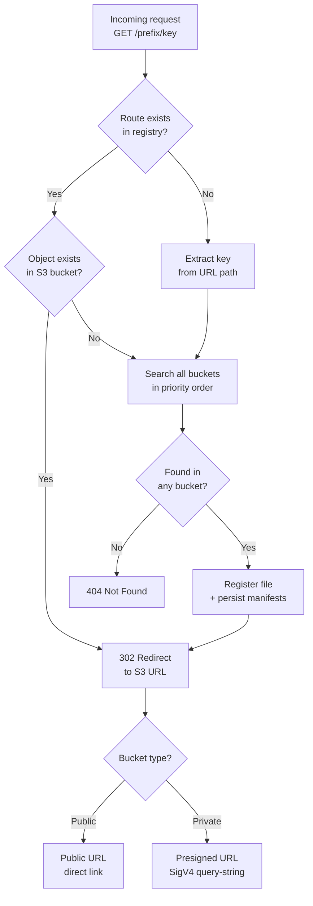
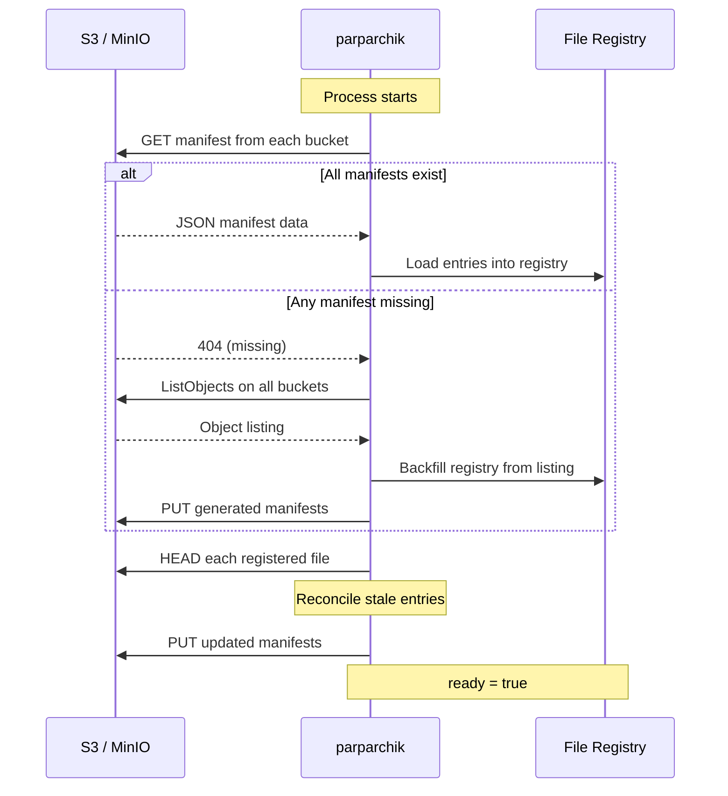

# parparchik

<p align="center">
  
</p>

`parparchik` is an S3 file routing service available in two implementations:
a **C++20** production server and an **OpenResty (Nginx + Lua)** alternative.
Both route versioned files from multiple configurable S3 buckets with public
or private access, serving redirects to S3 URLs.

## Features

- Dynamic file routes for each configured bucket.
- In-memory file registry loaded from JSON manifests stored in each bucket.
- Startup backfill from S3 when manifests do not exist yet.
- Bucket priority precedence when the same key exists in multiple buckets.
- Runtime repair when manifests are stale or disagree with real bucket contents.
- `/status`, `/redines`, `/readiness`, `/helthcheck`, and `/healthcheck` probes.
- Prometheus metrics for file counts per bucket, duplicate detection, and recent uploads.
- Prometheus alert rule for duplicate files across S3 buckets.
- Prometheus, Alertmanager, Grafana, Docker Compose, and Argo CD examples.
- Two implementations: C++ (production) and Nginx + Lua (alternative).

## High-level architecture

```mermaid
flowchart LR
  client([Client<br/>curl / app]) --> service

  subgraph service[parparchik HTTP service]
    direction TB
    router[Request Router] --> registry[(File Registry)]
    router --> s3client[S3 Client]
    router --> prom[/metrics]
  end

  s3client --> bucket1[(Bucket 1<br/>public)]
  s3client --> bucket2[(Bucket 2<br/>private)]
  s3client --> bucketN[(Bucket N)]

  bucket1 -.-> manifest1[Manifest JSON]
  bucket2 -.-> manifest2[Manifest JSON]
  bucketN -.-> manifestN[Manifest JSON]

  service -.->|302 redirect| client
```

## Implementation comparison

| Component | C++ | Nginx + Lua |
|-----------|-----|-------------|
| Runtime | cpp-httplib HTTP server | OpenResty (Nginx + LuaJIT) |
| S3 SDK | AWS SDK for C++ | Pure Lua SigV4 via OpenSSL FFI |
| State | `std::unordered_map` + mutex | `ngx.shared.DICT` (cross-worker) |
| JSON | nlohmann-json | lua-cjson (bundled) |
| Metrics | prometheus-cpp | Pure Lua text renderer |
| Concurrency | Thread pool | Event loop + coroutines |
| Build time | Minutes (vcpkg + CMake) | Seconds (Docker layer cache) |
| File routes | `/<bucket-name>/<key>` | `/public/<key>`, `/private/<key>` |

## Request routing flow



## Startup lifecycle



## Runtime flow

1. Startup reads manifests from all configured buckets using their respective keys.
2. If any manifest is missing, parparchik scans all buckets, builds the in-memory registry, writes manifests back, and becomes ready.
3. If manifests exist, parparchik loads them and verifies each record against actual S3 object existence.
4. If the same key exists in multiple buckets, the highest priority bucket (first in config) wins.
5. On request miss or stale route, parparchik checks buckets in priority order, serves the found route, updates memory, and writes all manifests.

## Manifest format

```json
{
  "version": 1,
  "bucket": "private-bucket",
  "files": [
    {
      "key": "1mb_v0.0.1_file.tgz",
      "bucket": "private-bucket",
      "route": "/private-bucket/1mb_v0.0.1_file.tgz",
      "size": 1048576,
      "last_modified": "2026-05-05T10:00:00Z"
    }
  ]
}
```

## API

| Endpoint | Description |
| --- | --- |
| `/status` | Configuration, readiness, and file count. |
| `/list` | Current in-memory registry entries. |
| `/update?filename=<key>` | Resolve a key and repair manifests on miss/stale state. |
| `POST /relocate?filename=<key>` | Verify file location, relocate registry entry between buckets. |
| `/metrics` | Prometheus metrics. |
| `/<bucket>/<key>` | Redirect to S3 URL — C++ edition. |
| `/public/<key>`, `/private/<key>` | Redirect to S3 URL — Nginx + Lua edition. |
| `/redines`, `/readiness` | Readiness probe. |
| `/helthcheck`, `/healthcheck` | Liveness probe. |

## Monitoring

`/metrics` exposes Prometheus gauges:

- `parparchik_volume_files{volume="<bucket>"}` — file count per bucket.
- `parparchik_duplicate_files` — file keys present in more than one bucket.
- `parparchik_uploads_per_week` / `parparchik_uploads_per_month` — recent upload activity.

`parparchik.rules.yml.example` defines a `ParparchikDuplicateFiles` alert that
fires when duplicates persist for 5 minutes. See [Monitoring](monitoring.md) for
full config examples.

## Common commands

**C++ (production):**

```bash
make build-all
make run-docker
make test-all
make test-mock-metrics
make docs-site
```

**Nginx + Lua (alternative):**

```bash
cd nginx-lua
make test-all
make status
make down
```

See [Operations](operations.md) for build, run, test, vcpkg cache, and
Kubernetes instructions. See [Nginx + Lua](nginx-lua.md) for the alternative
implementation details.
