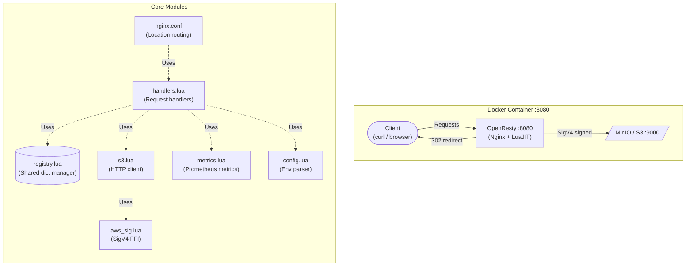
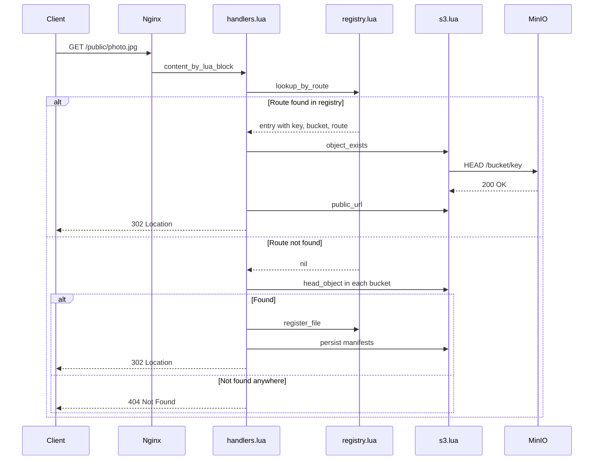
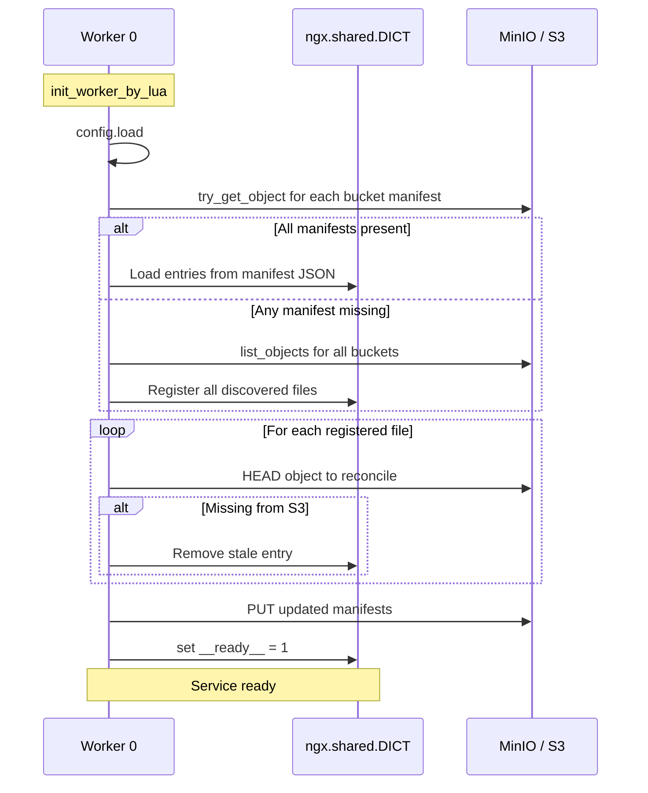
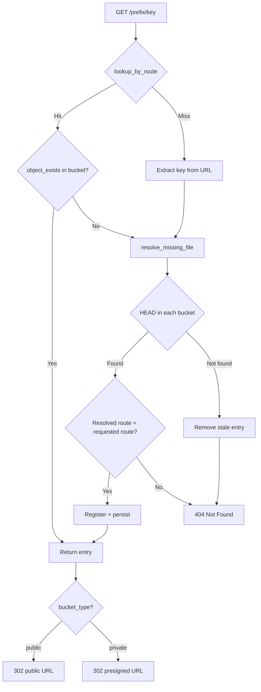

# Nginx + Lua Implementation

![[parparchik_lua_hld.png]]


Alternative implementation of parparchik using **OpenResty** (Nginx with LuaJIT).
Drop-in replacement with the same REST API, environment variables, and MinIO stack.

## Architecture



## Request lifecycle



## Startup sequence



## File routing decision tree



## Module reference

| Module | Purpose | Key functions |
|--------|---------|---------------|
| `config.lua` | Parse environment variables | `load()` |
| `aws_sig.lua` | AWS SigV4 signing | `sign_request()`, `presigned_url()` |
| `s3.lua` | S3 HTTP operations | `list_objects()`, `head_object()`, `get_object()`, `put_object()` |
| `registry.lua` | File registry | `register_file()`, `lookup()`, `lookup_by_route()`, `list_all()` |
| `metrics.lua` | Prometheus metrics | `render()` |
| `handlers.lua` | HTTP handlers + init | `init()`, `handle_status()`, `handle_list()`, `handle_download()` |

## Technology stack

| Layer | Technology | Purpose |
|-------|-----------|---------|
| Web server | OpenResty 1.27 (Alpine) | Nginx + LuaJIT runtime |
| HTTP client | lua-resty-http 0.17 | Non-blocking cosocket HTTP |
| Crypto | OpenSSL via LuaJIT FFI | HMAC-SHA256 for SigV4 |
| JSON | lua-cjson (bundled) | Request/response encoding |
| State | ngx.shared.DICT (10 MB) | Cross-worker file registry |
| Container | Docker + Compose | MinIO + OpenResty stack |

## Quick start

```bash
cd nginx-lua
make test-all    # Start stack + run 24-assertion e2e test
make status      # Check health
make down        # Stop everything
```

See `nginx-lua/README.md` for the full project README with additional diagrams.

