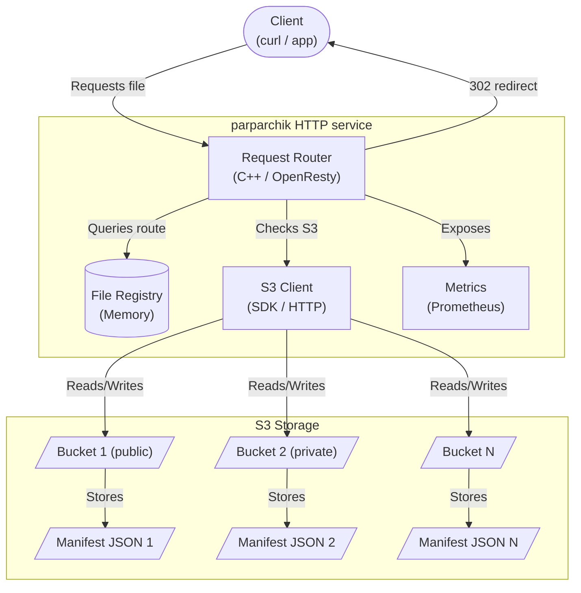

```mermaid
flowchart TD
    client(["Client<br/>(curl / app)"])
    
    subgraph Service["parparchik HTTP service"]
        router["Request Router<br/>(C++ / OpenResty)"]
        registry[("File Registry<br/>(Memory)")]
        s3client["S3 Client<br/>(SDK / HTTP)"]
        prom["Metrics<br/>(Prometheus)"]
        
        router -- "Queries route" --> registry
        router -- "Checks S3" --> s3client
        router -- "Exposes" --> prom
    end
    
    subgraph S3["S3 Storage"]
        bucket1[/"Bucket 1 (public)"/]
        bucket2[/"Bucket 2 (private)"/]
        bucketN[/"Bucket N"/]
        
        manifest1[/"Manifest JSON 1"/]
        manifest2[/"Manifest JSON 2"/]
        manifestN[/"Manifest JSON N"/]
        
        bucket1 -- "Stores" --> manifest1
        bucket2 -- "Stores" --> manifest2
        bucketN -- "Stores" --> manifestN
    end
    
    client -- "Requests file" --> router
    s3client -- "Reads/Writes" --> bucket1
    s3client -- "Reads/Writes" --> bucket2
    s3client -- "Reads/Writes" --> bucketN
    
    router -- "302 redirect" --> client
```
