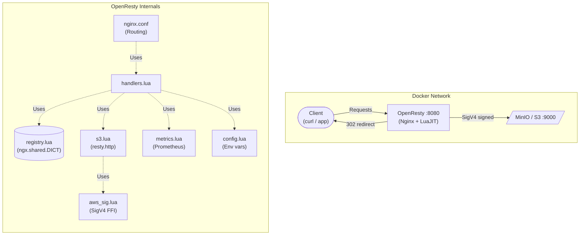
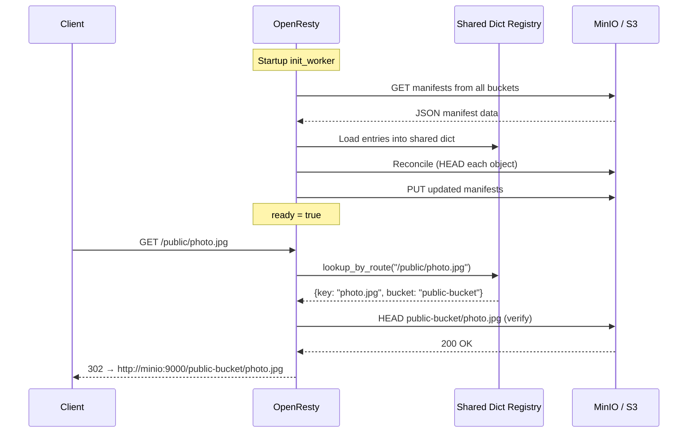
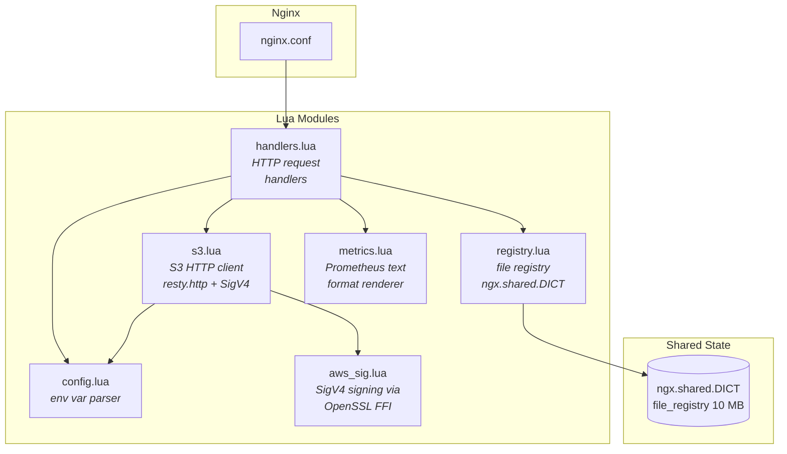
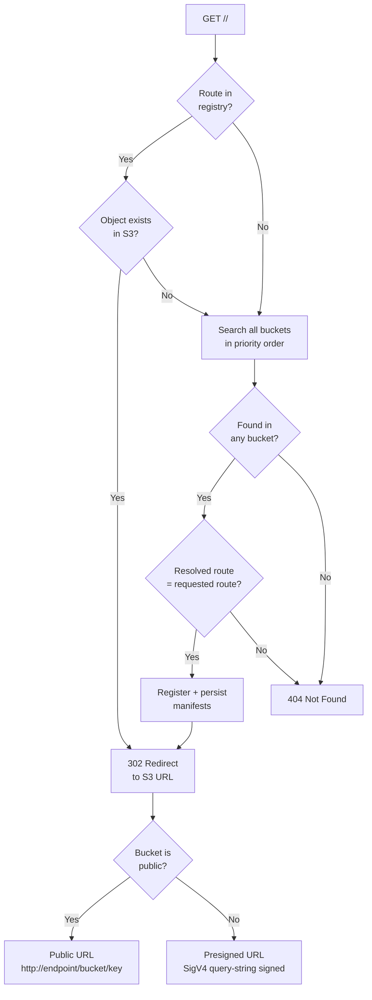

# parparchik — Nginx + Lua Edition

<p align="center">
  
</p>

Alternative implementation of the parparchik S3 file routing service using
**OpenResty** (Nginx with LuaJIT). Drop-in replacement for the C++ and Python
implementations — same REST API, same environment variables, same MinIO stack.

## Architecture



## How it works



## Module architecture



## File routing logic



## Quick start

```bash
# Start MinIO + parparchik
make up

# Run the full e2e test suite (24 assertions)
make test-all

# Check service health
make status

# Stop everything
make down
```

MinIO console: http://localhost:9001 (user: `minioadmin`, password: `minioadmin`).

## REST API

| Method | Endpoint                    | Description                                          |
|--------|-----------------------------|------------------------------------------------------|
| GET    | `/status`                   | Service health, bucket names, file count             |
| GET    | `/redines`, `/readiness`    | Kubernetes readiness probe                           |
| GET    | `/healthcheck` | Kubernetes liveness probe                          |
| GET    | `/list`                     | All registered files with bucket type and route      |
| GET    | `/update?filename=<name>`   | Sync and return current location of a file           |
| POST   | `/relocate?filename=<name>` | Verify file, relocate between buckets                |
| GET    | `/metrics`                  | Prometheus metrics                                   |
| GET    | `/public/<key>`             | 302 redirect to public S3 URL                        |
| GET    | `/private/<key>`            | 302 redirect to presigned S3 URL                     |

## Configuration

Same environment variables as the C++ and Python implementations:

| Variable | Default | Description |
| --- | --- | --- |
| `PARPARCHIK_PUBLIC_BUCKET` | | Public S3 bucket name |
| `PARPARCHIK_PRIVATE_BUCKET` | | Private S3 bucket name |
| `PARPARCHIK_BUCKETS` | | Multi-bucket config: `name:manifest:public,...` |
| `S3_ENDPOINT` | | Internal S3 endpoint (e.g. `minio:9000`) |
| `S3_EXTERNAL_ENDPOINT` | | External S3 endpoint for redirect URLs |
| `AWS_REGION` | `us-east-1` | AWS region |
| `AWS_ACCESS_KEY_ID` | | AWS/MinIO access key |
| `AWS_SECRET_ACCESS_KEY` | | AWS/MinIO secret key |

## Project structure

```
nginx-lua/
├── Dockerfile              OpenResty Alpine container
├── docker-compose.yml      MinIO + parparchik stack
├── Makefile                Build/run/test commands
├── nginx.conf              OpenResty route configuration
├── lua/
│   ├── config.lua          Environment variable parser
│   ├── aws_sig.lua         AWS SigV4 via OpenSSL FFI
│   ├── s3.lua              S3 client (resty.http)
│   ├── registry.lua        File registry (ngx.shared.DICT)
│   ├── metrics.lua         Prometheus text-format metrics
│   └── handlers.lua        HTTP request handlers
└── test/
    └── e2e_test.sh         End-to-end test (24 assertions)
```

## Technology stack

| Component | Technology | Purpose |
|-----------|-----------|---------|
| Web server | OpenResty 1.27 | Nginx + LuaJIT runtime |
| HTTP client | lua-resty-http | Non-blocking S3 requests |
| Crypto | OpenSSL via FFI | AWS SigV4 HMAC-SHA256 |
| State | ngx.shared.DICT | Cross-worker file registry |
| Metrics | Pure Lua | Prometheus text format |
| Container | Alpine Linux | Minimal Docker image |

## Comparison with C++ implementation

| Feature | C++ | Nginx + Lua |
|---------|-----|-------------|
| Binary size | ~20 MB + libs | ~60 MB (OpenResty) |
| Build time | Minutes (vcpkg + CMake) | Seconds (Docker layer cache) |
| Dependencies | AWS SDK, httplib, json, prometheus-cpp | lua-resty-http only |
| S3 signing | AWS SDK | Pure Lua SigV4 via FFI |
| State | `std::unordered_map` + mutex | `ngx.shared.DICT` |
| Concurrency | Thread pool | Nginx event loop + coroutines |
| Routes | `/bucket-name/key` | `/public/key`, `/private/key` |

## Makefile targets

```
make up          Start MinIO + parparchik containers
make down        Stop and remove all containers
make restart     Rebuild and restart everything
make test        Run e2e tests (containers must be running)
make test-all    Start containers + run e2e tests
make status      Check service status
make list        List all registered files
make metrics     Print Prometheus metrics
make logs        Tail container logs
make help        Show all targets
```

